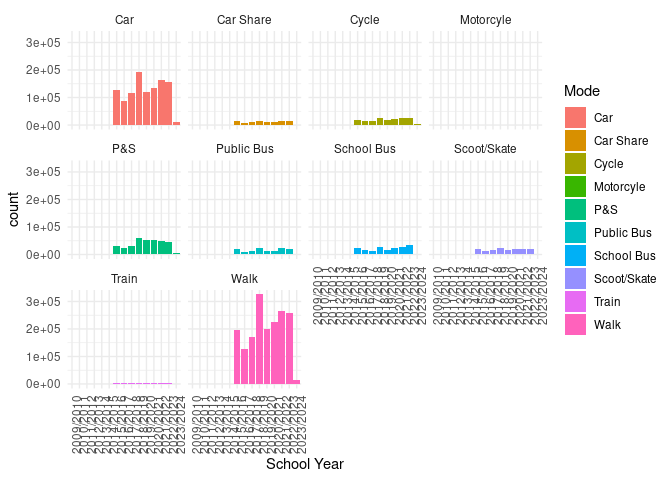
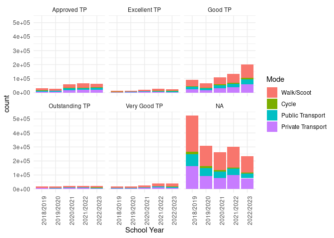
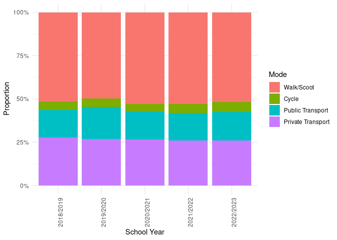
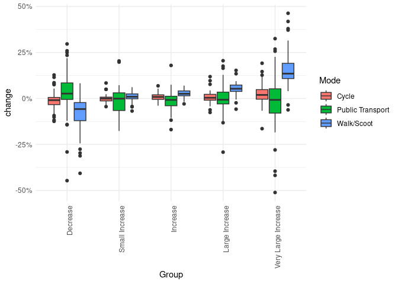

A plot of the counts of students using different modes of travel to
school over time (2018/2019 to 2022/2023 shown as years for which we
have a high response rate), with facets showing different travel plan
(TP) ratings, is shown below.

The modeshift dataset contains a detailed breakdown by mode, with the
number of observations for each mode and year shown below:

To get a handle on the rate of change, we’ll focus on a subset of
schools that have continuous records for the 5 years from 2018/2019 to
2022/2023. Of the 4958 schools in the dataset, 269 schools have
continuous records for the 5 years from 2018/2019 to 2022/2023.

Let’s calculate the rate of change in proportions:

Let’s visualise the change in % active travel by group, with breaks at
-0.5, 0, 0.01, 0.02, 0.05, 0.08, 1:

The graph shows that schools that have increased active travel
(excluding walking to public transport) have done so primarily by
boosting walking. However, some schools have been very successful in
boosting cycling. Summary statistics for the 10% of schools with the
largest increase in active travel, for walking and cycling, are shown
below:

Overall, we found that the 10% of schools with the largest increase in
active travel (walking and cycling) boosted walking by an average of 4.8
percentage points per year and cycling by an average of 1.9 percentage
points per year.
